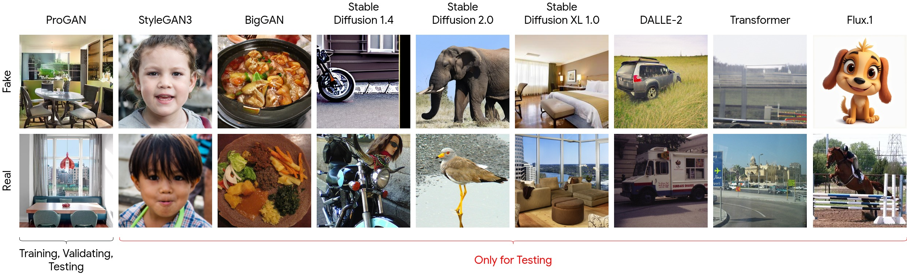

# FALCON: Forensic Artifact-guided Localization and Contrastive Reasoning for Generalizable Synthetic Image Detection

**Quang Huy Nguyen and Van Huy Pham**

[](https://arxiv.org/) [](https://ieeexplore.ieee.org/) [](https://www.kaggle.com/datasets/daddychillonkaggle/unirf-112k) 


## Abstract

Recent advances in generative models have significantly improved the realism of synthetic images, making cross-generator synthetic image detection increasingly challenging. Existing forensic detectors often learn generator-specific artifacts and therefore suffer substantial performance degradation when evaluated on unseen architectures. In this paper, we propose FALCON (Forensic-Aware Language-guided Contrastive Learning), a language-guided forensic framework that uses forensic-aware textual supervision to learn transferable visual representations. FALCON aligns image features with textual descriptions of semantic content and forensic traces, and then refines the detector with a hybrid contrastive and classification objective. To evaluate cross-generator robustness, we construct UniRF-112K, a balanced benchmark of 112,000 real and synthetic images spanning GANs, diffusion models, transformer-based generation, and flow matching. Under a one-generator training protocol, models are trained on ProGAN and evaluated across diverse held-out generators. Experimental results show that the best FALCON variant achieves a mean Average Precision (mAP) of 83.30%, outperforming LASTED by 8% and obtaining strong gains on several challenging unseen generators, including StyleGAN3, DiT, and Flux.1. Ablation results further indicate that combining image-class context with forensic trace descriptions provides the most effective textual supervision for generalized synthetic image detection.

## Dataset

- Name: UniRF-112K
- Scale: 112,000 images collected from 9 state-of-the-art generators
- Access: [Dataset link](https://www.kaggle.com/datasets/daddychillonkaggle/unirf-112k)
- Protocol note: Zero-shot setting (train on ProGAN, test on unseen architectures)




## Citation

If you find this work useful, please cite:

```bibtex
@article{nguyen2026falcon,
	title   = {FALCON: Forensic Artifact-guided Localization and Contrastive Reasoning for Generalizable Synthetic Image Detection},
	author  = {Nguyen, Quang Huy and Pham, Van Huy},
	journal = {arXiv preprint arXiv:XXXX.XXXXX},
	year    = {2026}
}
```

## Contact

- Quang Huy Nguyen: nguyenquanghuy.st@tdtu.edu.vn
- Van Huy Pham: huy.phamvan@umt.edu.vn
